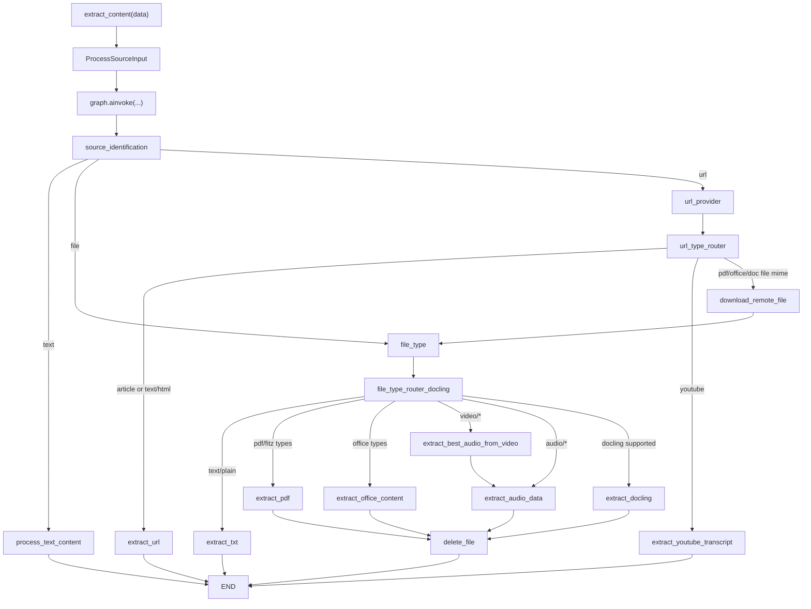
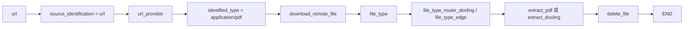

# content-core Extraction Workflow

本文梳理 `content_core` 里的内容抽取工作流，重点解释 `.venv/Lib/site-packages/content_core/content/extraction/graph.py` 这条 LangGraph 流程到底如何把 `文本 / 文件 / URL` 统一处理成标准化输出。

核心入口有两层：

- 包装入口：[`content_core/content/extraction/__init__.py`](</C:/Users/able2207008/公司/opensource/open-notebook/.venv/Lib/site-packages/content_core/content/extraction/__init__.py>)
- 工作流实现：[`content_core/content/extraction/graph.py`](</C:/Users/able2207008/公司/opensource/open-notebook/.venv/Lib/site-packages/content_core/content/extraction/graph.py>)

入口函数 `extract_content()` 本身非常薄，只做两件事：

1. 如果传入的是 `dict`，先转成 `ProcessSourceInput`
2. 调 `graph.ainvoke(...)` 执行 LangGraph，再把结果包装成 `ProcessSourceOutput`

也就是说，真正的业务逻辑几乎都在 `graph.py` 里。

## 状态模型

工作流围绕三种状态模型展开，定义在 [`content_core/common/state.py`](</C:/Users/able2207008/公司/opensource/open-notebook/.venv/Lib/site-packages/content_core/common/state.py>)：

- `ProcessSourceInput`
  - 输入层的最小请求模型
  - 只包含外部可传入字段：`content`、`file_path`、`url`，以及少量可选处理参数
- `ProcessSourceState`
  - 工作流运行时状态
  - 比输入多了中间字段，例如：`source_type`、`identified_type`、`metadata`、`title`、`content`
- `ProcessSourceOutput`
  - 最终输出模型
  - 保留抽取后的核心结果：`title`、`content`、`identified_type`、`metadata`

可以把它理解成：

- `Input`：用户/上游调用者交进来的原始请求
- `State`：图里各节点不断补全、修改的运行时上下文
- `Output`：对外暴露的稳定结果

## 整体流程图



这张图最重要的两个设计点是：

- 它先按“来源类型”粗分，再按“具体 MIME/Provider”细分
- URL 场景允许先识别成“远程文件”，下载到临时文件后复用文件处理链路

## 第一层路由：先判断来源来自哪里

节点：`source_identification()`  
位置：[`graph.py:39`](</C:/Users/able2207008/公司/opensource/open-notebook/.venv/Lib/site-packages/content_core/content/extraction/graph.py:39>)

逻辑非常直接：

- `state.content` 有值：认为是 `text`
- `state.file_path` 有值：认为是 `file`
- `state.url` 有值：认为是 `url`
- 都没有：直接报错

它做的不是复杂识别，而是确定“后面应该走哪条主干流程”。  
对应的条件路由函数是 `source_type_router()`，位置在 [`graph.py:108`](</C:/Users/able2207008/公司/opensource/open-notebook/.venv/Lib/site-packages/content_core/content/extraction/graph.py:108>)。

## 文本路径：最短路径

当来源被识别为 `text` 时，直接进入：

- `process_text_content`
- 注册位置：[`graph.py:205`](</C:/Users/able2207008/公司/opensource/open-notebook/.venv/Lib/site-packages/content_core/content/extraction/graph.py:205>)
- 路由位置：[`graph.py:216-219`](</C:/Users/able2207008/公司/opensource/open-notebook/.venv/Lib/site-packages/content_core/content/extraction/graph.py:216>)

这条路径的特点是：

- 不需要文件类型识别
- 不需要网络请求
- 不需要临时文件管理
- 直接对输入文本做清洗/规范化后结束

从架构上看，它是这张图里最“纯函数式”的分支。

## 文件路径：先识别 MIME，再决定处理器

### 1. 文件识别

节点：`file_type()`  
位置：[`graph.py:55`](</C:/Users/able2207008/公司/opensource/open-notebook/.venv/Lib/site-packages/content_core/content/extraction/graph.py:55>)

它调用了：

- `get_file_type(file_path)`
- 定义在 [`content_core/content/identification/__init__.py:4`](</C:/Users/able2207008/公司/opensource/open-notebook/.venv/Lib/site-packages/content_core/content/identification/__init__.py:4>)

这个函数最终会用 `FileDetector().detect(file_path)` 做纯 Python 文件类型识别。  
同时 `file_type()` 还顺手把文件名写入 `title`，来源是：

- `os.path.basename(file_path)`  
- 位置：[`graph.py:63-66`](</C:/Users/able2207008/公司/opensource/open-notebook/.venv/Lib/site-packages/content_core/content/extraction/graph.py:63>)

### 2. Docling 优先级路由

真正决定文件怎么处理的不是 `file_type_edge()`，而是更外层的：

- `file_type_router_docling()`
- 位置：[`graph.py:153`](</C:/Users/able2207008/公司/opensource/open-notebook/.venv/Lib/site-packages/content_core/content/extraction/graph.py:153>)

这一步会读取：

- `state.document_engine`
- 如果没有，则回退到 `get_document_engine()`

策略分三种：

- `auto`
  - 如果装了 Docling，并且当前 MIME 在 `DOCLING_SUPPORTED` 里，就走 `extract_docling`
  - 否则退回普通文件路由
- `docling`
  - 强制要求走 Docling
  - 但如果 Docling 不支持当前类型，仍会退回普通文件路由
- `simple`
  - 直接走普通文件路由

这说明它的设计目标不是“强依赖某个处理器”，而是：

- 在能力更强的抽取器可用时优先使用
- 不可用时尽量平滑退回基本路径

### 3. 普通文件路由

普通路由函数：

- `file_type_edge()`
- 位置：[`graph.py:69`](</C:/Users/able2207008/公司/opensource/open-notebook/.venv/Lib/site-packages/content_core/content/extraction/graph.py:69>)

它把 `identified_type` 映射到不同处理器：

- `text/plain` -> `extract_txt`
- `SUPPORTED_FITZ_TYPES` -> `extract_pdf`
- `SUPPORTED_OFFICE_TYPES` -> `extract_office_content`
- `video/*` -> `extract_best_audio_from_video`
- `audio/*` -> `extract_audio_data`

如果都不匹配，就抛：

- `UnsupportedTypeException`

这一步实际上就是“文件 MIME 到处理器节点名”的调度表。

## URL 路径：先判断是网页、YouTube，还是远程文件

### 1. URL provider 识别

节点：`url_provider()`  
位置：[`content_core/processors/url.py:30`](</C:/Users/able2207008/公司/opensource/open-notebook/.venv/Lib/site-packages/content_core/processors/url.py:30>)

它的工作不是抽正文，而是给 URL 先做粗分类：

- 如果 URL 包含 `youtube.com` 或 `youtu.be`
  - 直接标记成 `youtube`
- 否则先发一个 `HEAD` 请求看 `content-type`
  - 如果 MIME 属于 PDF / Office / Docling 支持类型
    - 标记成具体 MIME
  - 否则
    - 标记成 `article`

这一步特别重要，因为它决定了：

- `网页` 要直接走网页抽取
- `远程 PDF / Office 文件` 要先下载再当文件处理
- `YouTube` 要走专门转录路径

### 2. URL 条件路由

路由位置：[`graph.py:225-239`](</C:/Users/able2207008/公司/opensource/open-notebook/.venv/Lib/site-packages/content_core/content/extraction/graph.py:225>)

映射关系是：

- `article` -> `extract_url`
- `text/html` -> `extract_url`
- `youtube` -> `extract_youtube_transcript`
- 远程文件 MIME（PDF / Office / Docling 支持类型）-> `download_remote_file`

这是整个 workflow 里最“聪明”的部分之一：  
同样都是 URL，它不会一刀切按网页处理，而是先判断这个 URL 背后其实是什么资源。

## 远程文件下载：把 URL 变成 file_path

节点：`download_remote_file()`  
位置：[`graph.py:124`](</C:/Users/able2207008/公司/opensource/open-notebook/.venv/Lib/site-packages/content_core/content/extraction/graph.py:124>)

它内部先调用：

- `_fetch_remote_file()`
- 位置：[`graph.py:113`](</C:/Users/able2207008/公司/opensource/open-notebook/.venv/Lib/site-packages/content_core/content/extraction/graph.py:113>)

下载成功后会：

1. 取响应头里的 MIME
2. 用 `tempfile.mkstemp()` 创建临时文件
3. 把远程内容写入临时文件
4. 返回：
   - `file_path`
   - `identified_type`

然后图里从：

- `download_remote_file -> file_type`
- 位置：[`graph.py:253`](</C:/Users/able2207008/公司/opensource/open-notebook/.venv/Lib/site-packages/content_core/content/extraction/graph.py:253>)

这意味着“远程文件 URL”后续完全复用本地文件处理流程。  
这是一个很实用的设计：不用为“远程 PDF”“本地 PDF”分别维护两套抽取逻辑。

## 音视频路径：视频先抽音频，再做音频转写

文件分流里对多媒体处理做了串联：

- `video/*` -> `extract_best_audio_from_video`
- 然后 -> `extract_audio_data`
- 位置：[`graph.py:250`](</C:/Users/able2207008/公司/opensource/open-notebook/.venv/Lib/site-packages/content_core/content/extraction/graph.py:250>)

而对 `audio/*`：

- 直接 -> `extract_audio_data`

这说明在架构上，它把“视频内容抽取”视为：

- 先拿到最佳音轨
- 再统一进入音频转写逻辑

这样可以保证：

- 视频和音频共用同一套 STT 能力
- 视频处理器只关注“提取音频”，不负责语义转写

## 文件清理：只在部分分支上触发

节点：`delete_file()`  
位置：[`graph.py:88`](</C:/Users/able2207008/公司/opensource/open-notebook/.venv/Lib/site-packages/content_core/content/extraction/graph.py:88>)

它的行为很简单：

- `state.delete_source == True` 时尝试删除 `file_path`
- 删除成功后把 `file_path` 置为 `None`
- 否则不做事

图上的接法很说明设计意图：

- `extract_pdf -> delete_file`
- `extract_office_content -> delete_file`
- `extract_audio_data -> delete_file`

这意味着它主要清理的是“真正落在磁盘上的文件”，包括：

- 用户上传的本地文件
- URL 下载下来的临时文件
- 视频抽取音频后可能产生的中间文件

而网页正文和纯文本路径不需要这一步，因为它们本来就没有持久文件要删。

## 工作流定义方式

图的骨架在 [`graph.py:187-255`](</C:/Users/able2207008/公司/opensource/open-notebook/.venv/Lib/site-packages/content_core/content/extraction/graph.py:187>)。

它使用了：

```python
workflow = StateGraph(
    ProcessSourceState,
    input_schema=ProcessSourceInput,
    output_schema=ProcessSourceState
)
```

然后：

- `add_node(...)` 注册处理节点
- `add_edge(...)` 定义固定边
- `add_conditional_edges(...)` 定义路由边
- `compile()` 得到最终 `graph`

这类写法的优点是：

- 流程结构在代码里显式可见
- 节点职责清晰
- 很适合把“内容抽取这种多分支流程”建模成状态机

## 一个最典型的例子

### 例子 1：远程 PDF URL



这说明：

- URL 不一定直接抽网页
- 远程文件会先下载成临时文件
- 后续统一复用文件处理链路

### 例子 2：YouTube URL


这说明 YouTube 是被明确当作一种特殊 provider 处理的，而不是普通网页。

## 这个 workflow 的设计思想

结合代码来看，这个 workflow 有 4 个很鲜明的设计选择：

1. 统一输入模型  
   不管来源是文本、文件还是 URL，最终都进入同一张状态图。

2. 分层路由  
   先按来源类型分流，再按 MIME/provider 细分，而不是一开始就把所有情况混在一起判断。

3. 尽量复用处理链  
   远程文件 URL 会先下载再走文件链路，视频会先抽音频再走音频链路。

4. 把资源清理放进图里  
   临时文件删除不是外围脚本顺手做，而是作为 workflow 的正式节点存在。

## 建议你接下来继续看的文件

如果你想继续顺着这条链往下看，推荐顺序是：

1. [`content_core/processors/url.py`](</C:/Users/able2207008/公司/opensource/open-notebook/.venv/Lib/site-packages/content_core/processors/url.py>)
   - 看网页 URL 的 provider 识别和正文抽取
2. [`content_core/processors/pdf.py`](</C:/Users/able2207008/公司/opensource/open-notebook/.venv/Lib/site-packages/content_core/processors/pdf.py>)
   - 看 PDF 具体怎么转成内容
3. [`content_core/processors/audio.py`](</C:/Users/able2207008/公司/opensource/open-notebook/.venv/Lib/site-packages/content_core/processors/audio.py>)
   - 看 STT 参数如何消费 `audio_provider/audio_model`
4. [`open_notebook/graphs/source.py`](</C:/Users/able2207008/公司/opensource/open-notebook/open_notebook/graphs/source.py>)
   - 看 Open Notebook 是怎么把 `extract_content()` 嵌入自己业务流程里的

